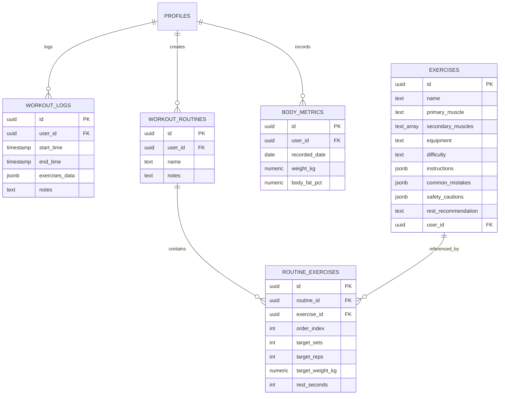

# 🏋️ MuscleMap (FitTrack Pro)

<div align="center">


[](https://musclemap-bd.vercel.app)


<br />

**A modern, mobile-first fitness tracking & workout companion web application with real-time logging, interactive exercise library, in-depth progress analytics, full bilingual support (English & বাংলা), and PWA installability.**

[Key Features](#-key-features) • [Tech Stack](#-tech-stack) • [Database Setup](#-database-setup) • [Installation](#-getting-started) • [PWA Mobile Guide](#-mobile-installation-pwa)

</div>

---

## ✨ Key Features

### ⚡ 1. Live Gym & Active Workout Tracker
* **Real-time Logging**: Record sets, reps, weights (kg), and set completion with instant visual feedback.
* **Smart Rest Timer**: Integrated countdown timer with sound/visual alert between sets to optimize recovery.
* **Offline State Persistence**: Automatically preserves active workouts in `localStorage` in real-time — gym connection drops or page refreshes won't lose your current session.
* **Quick Routine Starters**: Launch predefined routines or start an empty quick workout in 1 tap.

### 🗺️ 2. Comprehensive Exercise & Muscle Library (77 Exercises)
* **Predefined Database**: 77 scientifically backed exercises across Chest, Back, Shoulders, Legs (Quads, Hamstrings, Calves), Biceps, Triceps, Forearms, and Core/Abs.
* **Detailed Exercise Guides**: Step-by-step performance instructions, common mistakes to avoid, safety cautions, and recommended rest times.
* **Instant Search & Filtering**: Multi-dimensional filtering by muscle group, equipment (Barbell, Dumbbell, Cable, Machine, Bodyweight), and difficulty level.

### 📈 3. Advanced Analytics & Progress Dashboard
* **Strength & Volume Progression**: Interactive area and line charts powered by `recharts`.
* **Personal Record (PR) Leaderboard**: Automatically tracks top single-set volumes and max weights.
* **Muscle Split Distribution**: Visual breakdown of targeted muscle groups over time.
* **Body Metrics Tracker**: Weight logging with trend visualization and optimistic updates.
* **Streaks & Consistency KPI**: Dynamic workout frequency heatmap and streak counter.

### 📋 4. Routine Builder & Data Management
* **Split Creator**: Build custom multi-day splits (Push/Pull/Legs, Upper/Lower, Full Body, 3-5 day custom splits).
* **CSV Export & Import**: Export workout logs, stats, and PRs, or import custom routines via CSV files.

### 🇧🇩 5. Full Bilingual Support (English & বাংলা)
* **Bilingual UI**: Complete app-wide translations for all cards, forms, timers, metrics, and library instructions.
* **Native Typography**: Integrated Google Font **Hind Siliguri** for Bengali rendering alongside **Outfit**.
* **Instant Toggle**: Switch between English and বাংলা seamlessly in the Profile menu.

### 📱 6. Mobile-First Progressive Web App (PWA)
* **Installable on iOS & Android**: Standalone app mode with custom high-res icons and dark status bar integration.
* **Responsive Mobile Container**: Optimized with modern glassmorphism aesthetics on dark obsidian styling.

---

## 🛠️ Tech Stack

| Layer | Technology |
|---|---|
| **Framework** | [Next.js 16 (Turbopack, App Router)](https://nextjs.org/) |
| **UI Library** | [React 19](https://react.dev/) |
| **Language** | [TypeScript](https://www.typescriptlang.org/) |
| **Styling** | [Tailwind CSS](https://tailwindcss.com/) + Glassmorphism + [Lucide Icons](https://lucide.dev/) |
| **Components** | Radix UI primitives / Shadcn UI + [Sonner Toasts](https://sonner.emilkowal.ski/) |
| **Charts** | [Recharts](https://recharts.org/) |
| **Backend & Auth** | [Supabase](https://supabase.com/) (PostgreSQL + Row-Level Security + Auth) |
| **i18n & Fonts** | Custom typed dictionary system + Google Fonts (`Outfit`, `Hind_Siliguri`) |
| **PWA** | Web App Manifest + Standalone Viewport + Maskable & Apple Touch Icons |

---

## 📁 Project Structure

```text
MuscleMap/
└── fit-track-pro/
    ├── public/                     # High-DPI PWA icons & static assets
    │   ├── apple-touch-icon.png
    │   ├── icon-192x192.png
    │   └── icon-512x512.png
    ├── src/
    │   ├── app/
    │   │   ├── layout.tsx          # Root layout, fonts (Outfit + Hind Siliguri), Toast provider
    │   │   ├── manifest.ts         # PWA Web App Manifest configuration
    │   │   ├── page.tsx            # Home dashboard (Server component)
    │   │   ├── HomeDashboardView.tsx # Localized Home client view
    │   │   ├── muscles/            # Exercise library & muscle detail routes
    │   │   │   ├── page.tsx
    │   │   │   ├── ExerciseLibrary.tsx
    │   │   │   └── [id]/           # Exercise detail with form cues & safety tips
    │   │   ├── workout/            # Workout hub & builder
    │   │   │   ├── page.tsx
    │   │   │   ├── active/         # Active gym tracker with live timers
    │   │   │   └── builder/        # Custom split & routine builder
    │   │   ├── progress/           # Charts, PR tracking, and analytics dashboard
    │   │   └── profile/            # Body metrics, CSV data management, language switcher
    │   ├── components/             # Reusable UI components (BottomNav, LanguageToggle, etc.)
    │   └── lib/
    │       ├── constants.ts        # Shared constants & storage keys
    │       ├── utils.ts            # Date formatting, streaks, time computations
    │       ├── i18n/               # Translation engine & dictionaries
    │       │   ├── types.ts        # Strict dictionary schema types
    │       │   ├── LanguageContext.tsx # Context provider & useLanguage() hook
    │       │   └── dictionaries/   # en.ts & bn.ts
    │       └── supabase/           # Browser & server Supabase client instances
    ├── generate_seed.js            # Seed generator script (77 exercises)
    ├── seed.sql                    # SQL seed script with full exercise library
    └── generate_pwa_icons.js       # PWA vector-to-PNG icon generation script
```

---

## 🚀 Getting Started

### 1. Clone the repository
```bash
git clone https://github.com/Coder-Sadik/MuscleMap.git
cd MuscleMap/fit-track-pro
```

### 2. Install dependencies
```bash
npm install
```

### 3. Configure Environment Variables
Create a `.env.local` file in `fit-track-pro/` with your Supabase project credentials:
```env
NEXT_PUBLIC_SUPABASE_URL=your_supabase_project_url
NEXT_PUBLIC_SUPABASE_ANON_KEY=your_supabase_anon_key
```

### 4. Database Setup & Seeding
Execute the SQL schema in your Supabase SQL Editor and run `seed.sql` to populate all **77 predefined exercises**:
```bash
# seed.sql contains idempotent queries (WHERE NOT EXISTS) to populate all exercises safely
```

### 5. Run Development Server
```bash
npm run dev
```
Open [http://localhost:3000](http://localhost:3000) in your browser.

### 6. Build for Production
```bash
npm run build
npm run start
```

---

## 📱 Mobile Installation (PWA)

FitTrack Pro can be installed on any modern smartphone as a standalone web application:

### 🍎 iOS (iPhone / iPad)
1. Open the app in **Safari**.
2. Tap the **Share** button (box with upward arrow).
3. Select **"Add to Home Screen"** (হোম স্ক্রিনে যোগ করুন).
4. Tap **Add**. The app will appear on your home screen with a native full-screen experience.

### 🤖 Android (Chrome / Brave / Edge / Samsung)
1. Open the app in your mobile browser.
2. Tap the **Menu (⋮)** in the top right.
3. Select **"Install app"** or **"Add to Home screen"**.
4. Tap **Install**.

---

## 🗄️ Database Schema Overview



---

## 📄 License

This project is licensed under the [MIT License](LICENSE).
