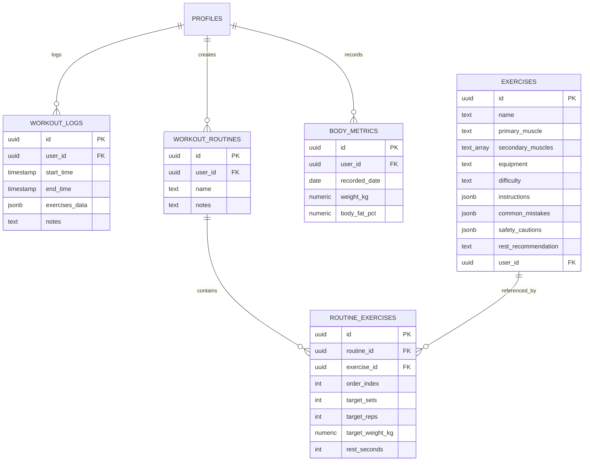

# 🏋️ MuscleMap — Full-Stack Fitness & Anatomy Platform

<div align="center">

[](https://musclemapbd.vercel.app/)
[](https://github.com/Coder-Sadik/MuscleMap)


<br />

### 🚀 **[Experience the Live Application → https://musclemapbd.vercel.app/](https://musclemapbd.vercel.app/)**

**A high-performance, mobile-first progressive web application (PWA) built for athletes, gym-goers, and fitness enthusiasts. Features real-time gym logging, live stopwatch timers, 77-exercise anatomy library, strength progression analytics, custom routine builder with drag-and-drop, and full bilingual support (English & বাংলা).**

[Live Demo](https://musclemapbd.vercel.app/) • [Recruiter Highlights](#-engineering--recruiter-highlights) • [Key Features](#-key-features) • [Tech Stack](#-tech-stack) • [Database Architecture](#-database-architecture) • [Local Setup](#-getting-started) • [PWA Guide](#-mobile-installation-pwa)

</div>

---

## 👨‍💻 Engineering & Recruiter Highlights

| Capability | Technical Implementation |
|---|---|
| **Modern Frontend Architecture** | Built with **Next.js 16 (App Router + Turbopack)** and **React 19**, maximizing server-side rendering (SSR), streaming, and lightweight client components. |
| **Resilient Offline & Crash Persistence** | Active workout sessions sync continuously with `localStorage` state caching, guaranteeing zero data loss during network drops or page reloads. |
| **PostgreSQL & Row-Level Security (RLS)** | Full multi-tenant data isolation using Supabase Auth and PostgreSQL RLS policies; users only access their personal logs and custom routines. |
| **Zero-Dependency Typed i18n Engine** | Lightweight custom dictionary system delivering instant language switching (**English ⇄ বাংলা**) with strict TypeScript type safety and zero bundle overhead. |
| **Interactive Data Visualizations** | Custom analytics charts powered by `recharts` for volume trends, strength curves, muscle split distributions, and PR tracking. |
| **Fluid Drag-and-Drop UX** | Routine builder powered by `@dnd-kit` with keyboard and touch sensors for effortless split creation and exercise reordering. |
| **Native PWA Feel** | Standalone manifest, custom high-DPI maskable icons, dynamic viewport safe-area handling, and dark obsidian aesthetic. |

---

## ✨ Key Features

### ⚡ 1. Live Gym Tracker & Active Workout Mode
* **Precision Stopwatch & Controls**: Interactive **Start / Pause / Resume** timer controls, preventing unwanted counting before you begin.
* **Rapid Set Logging**: Log weight (kg) and reps with quick-increment buttons and instant completed checkoffs.
* **Auto-Rest Countdown**: Smart rest interval timer with visual and auditory feedback to optimize recovery between sets.
* **Safety & Workout Controls**: Delete unwanted exercises, remove extra sets, or discard accidental workouts seamlessly.
* **Previous Session Autofill**: Automatically displays your previous workout weights and reps for every exercise.

### 🗺️ 2. Comprehensive Exercise & Muscle Library (77 Exercises)
* **Curated Database**: 77 exercises spanning Chest, Back, Shoulders, Legs (Quads, Hamstrings, Calves), Biceps, Triceps, Forearms, and Core/Abs.
* **Form & Technique Guidance**: Step-by-step instructions, common mistakes to avoid, safety cautions, and recommended rest times.
* **Instant Multi-Filter**: Filter exercises by primary muscle, equipment (Barbell, Dumbbell, Cable, Machine, Bodyweight), and difficulty.

### 📈 3. Progress Analytics & PR Leaderboard
* **Volume Progression**: Dynamic charts tracking weekly and monthly workload progression.
* **PR Recognition**: Automatic detection and celebratory badges for all-time volume records and max weight lifts.
* **Muscle Split Distribution**: Visual percentage breakdown of targeted muscle groups.
* **Body Metrics**: Body weight tracking with trend visualization and optimistic updates.
* **Consistency Heatmap**: Workout frequency tracker and active streak counter.

### 📋 4. Custom Routine Builder & Data Portability
* **Custom Split Creator**: Design Push/Pull/Legs, Upper/Lower, or 3-5 day splits.
* **Drag-and-Drop Reordering**: Rearrange exercise sequence smoothly using touch-optimized drag-and-drop.
* **CSV Export & Import**: Export workout logs, stats, and personal records for full data ownership.

### 🇧🇩 5. Full Bilingual Support (English & বাংলা)
* Complete application interface translated in English and বাংলা with native typography (**Outfit** + **Hind Siliguri**).

---

## 🛠️ Tech Stack

```text
Frontend:   Next.js 16 (App Router) • React 19 • TypeScript • Tailwind CSS 4 • Lucide Icons
Components: Radix UI primitives • Shadcn UI • Sonner Toasts • @dnd-kit
Charts:     Recharts (Volume Progression, Muscle Distribution, Body Weight)
Database:   Supabase (PostgreSQL + Auth + Row Level Security)
PWA:        Web App Manifest • Standalone Display • Maskable Icons
Deployment: Vercel CI/CD Edge Network (https://musclemapbd.vercel.app/)
```

---

## 📁 Project Structure

```text
MuscleMap/
├── public/                     # High-DPI PWA icons & static assets
│   ├── apple-touch-icon.png
│   ├── icon-192x192.png
│   └── icon-512x512.png
├── src/
│   ├── app/
│   │   ├── layout.tsx          # Root layout, Google fonts (Outfit + Hind Siliguri), Toast provider
│   │   ├── manifest.ts         # PWA Web App Manifest configuration
│   │   ├── page.tsx            # Home dashboard (Server component)
│   │   ├── HomeDashboardView.tsx # Localized Home client view
│   │   ├── muscles/            # Exercise library & muscle detail routes
│   │   │   ├── page.tsx
│   │   │   ├── ExerciseLibrary.tsx
│   │   │   └── [id]/           # Exercise detail with form cues & safety tips
│   │   ├── workout/            # Workout hub & builder
│   │   │   ├── page.tsx
│   │   │   ├── active/         # Active gym tracker with live timers
│   │   │   └── builder/        # Custom split & routine builder
│   │   ├── progress/           # Charts, PR tracking, and analytics dashboard
│   │   └── profile/            # Body metrics, CSV data management, language switcher
│   ├── components/             # Reusable UI components (BottomNav, LanguageToggle, etc.)
│   └── lib/
│       ├── constants.ts        # Shared constants & storage keys
│       ├── utils.ts            # Date formatting, streaks, time computations
│       ├── i18n/               # Translation engine & dictionaries
│       │   ├── types.ts        # Strict dictionary schema types
│       │   ├── LanguageContext.tsx # Context provider & useLanguage() hook
│       │   └── dictionaries/   # en.ts & bn.ts
│       └── supabase/           # Browser & server Supabase client instances
├── supabase/                   # Organized database schema, migrations & seed SQL scripts
│   ├── schema.sql              # Core PostgreSQL database tables & RLS policies
│   ├── seed.sql                # 77 scientifically backed predefined exercises
│   ├── alter_schema.sql        # Table extensions and schema migrations
│   └── fix_linter.sql          # Performance & RLS security policy optimizations
├── generate_seed.js            # Seed generator script (77 exercises)
└── generate_pwa_icons.js       # PWA vector-to-PNG icon generation script
```

---

## 🗄️ Database Architecture



---

## 🚀 Getting Started

### 1. Clone the repository
```bash
git clone https://github.com/Coder-Sadik/MuscleMap.git
cd MuscleMap
```

### 2. Install dependencies
```bash
npm install
```

### 3. Configure Environment Variables
Create a `.env.local` file in the project root:
```env
NEXT_PUBLIC_SUPABASE_URL=your_supabase_project_url
NEXT_PUBLIC_SUPABASE_ANON_KEY=your_supabase_anon_key
```

### 4. Database Setup & Seeding
Execute `supabase/schema.sql` in your Supabase SQL Editor, followed by `supabase/seed.sql` to populate all **77 predefined exercises**:
```bash
# supabase/seed.sql contains idempotent queries (WHERE NOT EXISTS) to populate all exercises safely
```

### 5. Run Development Server
```bash
npm run dev
```
Open [http://localhost:3000](http://localhost:3000) in your browser.

### 6. Build for Production
```bash
npm run build
npm run start
```

---

## 📱 Mobile Installation (PWA)

MuscleMap can be installed directly on any smartphone as a standalone web application:

### 🍎 iOS (iPhone / iPad)
1. Open **[https://musclemapbd.vercel.app](https://musclemapbd.vercel.app)** in **Safari**.
2. Tap the **Share** button (square with arrow pointing up).
3. Tap **"Add to Home Screen"** (হোম স্ক্রিনে যোগ করুন).
4. Tap **Add**. The app will launch with a native full-screen experience.

### 🤖 Android (Chrome / Brave / Edge / Samsung)
1. Open **[https://musclemapbd.vercel.app](https://musclemapbd.vercel.app)** in your browser.
2. Tap the **Menu (⋮)** in the top right.
3. Select **"Install app"** or **"Add to Home screen"**.
4. Tap **Install**.

---

## 👤 Author

**Sadik**
* GitHub: [@Coder-Sadik](https://github.com/Coder-Sadik)
* Repository: [MuscleMap](https://github.com/Coder-Sadik/MuscleMap)
* Live Application: [musclemapbd.vercel.app](https://musclemapbd.vercel.app/)

---

## 📄 License

This project is open source and available under the [MIT License](LICENSE).

